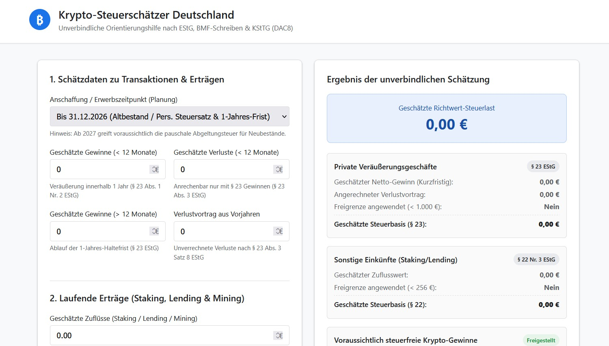

## ₿ Krypto-Steuerschätzer

Kostenloses und unverbindliches Privat-Webtool zur Abschätzung und Orientierung bezüglich der Steuereffekte von Kryptowährungstransaktionen. 

Dieses Repo bietet eine benutzerfreundliche Oberfläche, um potenzielle Steuerlasten auf Basis eingegebener Gewinne, Haltedauern und Freibeträge schnell abzuschätzen.

---

## 🏞️ Screenshot



---

## 📜 Disclaimer

 Dieses Tool ist ein reines Demonstrations- und Informationswerkzeug und liefert **ausschließlich eine unverbindliche Orientierungsschätzung**. Es stellt ausdrücklich **keine Steuerberatung, Rechtsberatung oder finanzielle Auskunft** dar und ersetzt keinesfalls die individuelle Beratung durch einen Steuerberater.

Sämtliche Ausgaben sind Richtwerte, die auf vereinfachten Modellrechnungen und den vom Nutzer eingegebenen Daten basieren. Es werden keine Gewähr, Haftung oder Vollständigkeitsgarantie für die steuerliche Richtigkeit, Aktualität oder die Anerkennung durch die Finanzbehörden übernommen. 

---

## 🚀 Features

* **Schnelle Berechnung:** Sofortige Rückmeldung über geschätzte Steuerbeträge.
* **Benutzerfreundliches UI:** Klare und responsive Benutzeroberfläche (HTML, CSS, JS).
* **Datenschutzfreundlich:** Alle Eingaben werden lokal im Browser verarbeitet.

---

## 🛠️ Technologien

* **Frontend:** HTML5, CSS3, JavaScript (ES6+)
* **Backend / Logik:** Python (sofern serverseitig integriert) / Client-side JS

---

## 📦 Installation & Lokal ausführen

1. **Repository klonen:**
   ```bash
   git clone [https://github.com/dein-username/Krypto-Steuerschaetzer.git](https://github.com/dein-username/Krypto-Steuerschaetzer.git)
   cd Krypto-Steuerschaetzer
